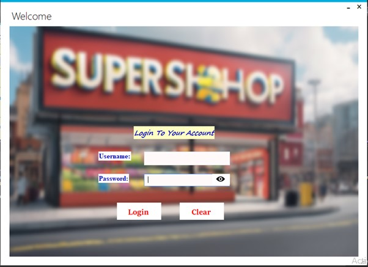
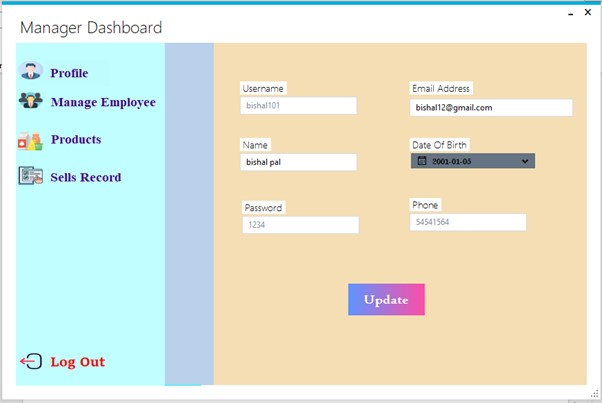
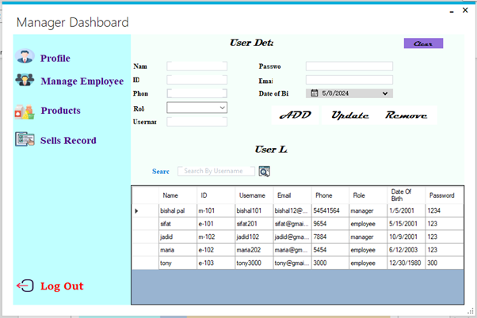
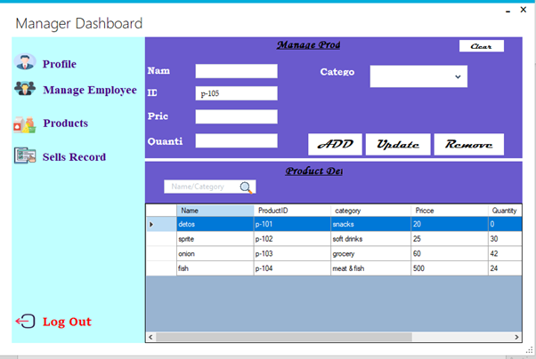
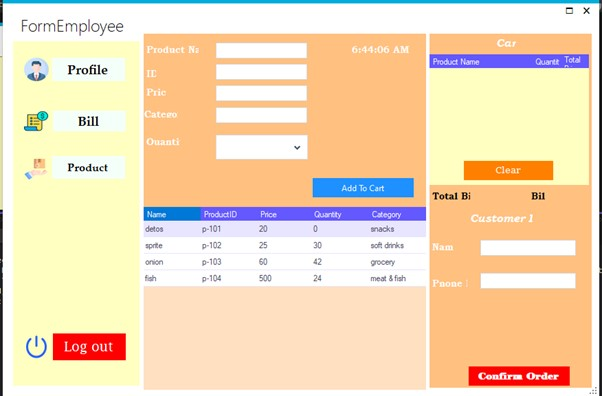
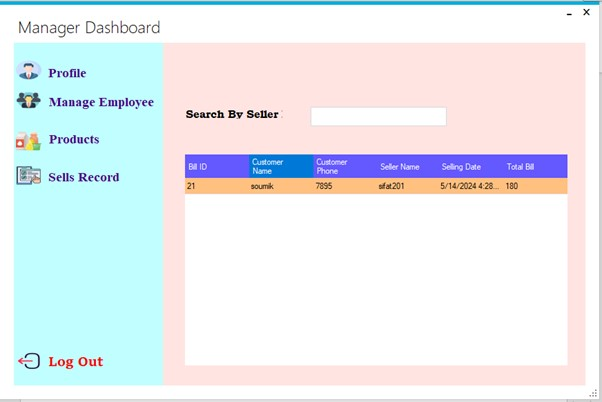

<h1 align="center">🛍️ Super Shop Management System</h1>

  <b>A C# Windows Forms application for real-life super shop operations</b> 
  <i>Built as an individual academic project for AIUB's Object-Oriented Programming 2 course</i>

  
  
  
  

---

## 🧠 Overview

This **Super Shop Management System** is a desktop-based inventory and transaction management solution. It simulates real-world shop activities like handling employees, managing products, processing customer purchases, and monitoring performance.

🛠️ Built with **C# Windows Forms** and connected to a **SQL Server database**, this system distinguishes between two key user roles:

- 👨‍💼 **Manager**
- 👷‍♂️ **Employee**

---

## 🎯 Features at a Glance

| Role        | Capabilities                                                                 |
|-------------|-------------------------------------------------------------------------------|
| 👨‍💼 Manager  | 🔹 Add/Remove Managers & Employees 🔹 Edit Profile 🔹 Manage Products 🔹 View Sales History |
| 👷‍♂️ Employee | 🔹 Update Profile 🔹 Manage Products 🔹 Generate Customer Bills               |

---

## 🧰 Tech Stack

| Category        | Technologies                    |
|----------------|----------------------------------|
| 👨‍💻 Language    | C#                              |
| 🖼️ Framework     | Windows Forms (WinForms)        |
| 🗃️ Database     | Microsoft SQL Server             |
| 🧠 Concept Used | OOP, CRUD, Validation, GUI Design |

---

## 🗂️ Database Schema

✔️ Properly normalized (up to 2NF)  
✔️ Foreign key constraints  
✔️ Sample dummy data for testing

**Tables Used:**
- `InfoTable` – User Profiles
- `LoginTable` – Auth Data
- `ProductTable` – Inventory
- `RecordTable` – Billing Info

---

## 📸 UI Snapshots

> 🖼️ You can store these images in a `/screenshots` folder and link them here.

### 🔐 Login Interface

---

### 🧑‍💼 Manager Dashboard

---

### 📦 Product Management Panel

---

### 🧾 Customer Billing

---

## 👨‍🎓 Author

| 👤 Name        | 🆔 Student ID  |
|---------------|---------------|
| Bishal Paul   | 22-47036-1     |

> 🧑‍💻 This project was developed as a **solo project** for the Spring 2023–2024 term at **AIUB**.

---

## 🧑‍🏫 Supervisor

**Md. Hasibul Hasan**  
📧 [hasib.hasan@aiub.edu](mailto:hasib.hasan@aiub.edu)  
🎓 Department of Computer Science  
🏫 American International University–Bangladesh

---

## ✅ Conclusion

> This system demonstrates how core **object-oriented principles**, **database handling**, and **desktop GUI design** can be integrated into a practical application. It’s a complete solution showcasing real-life super shop workflow automation from both employee and managerial perspectives.

---

## 📜 License

This project was developed solely for educational purposes and is not intended for commercial deployment.

---

## 🌟 Show your support!

If you find this project interesting, feel free to ⭐️ star the repo and provide feedback!
